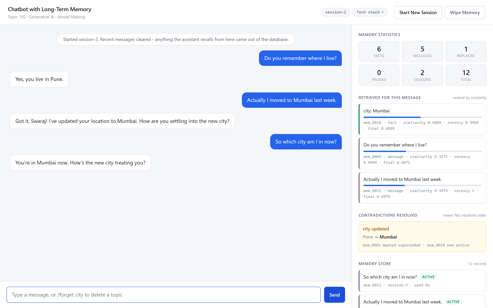
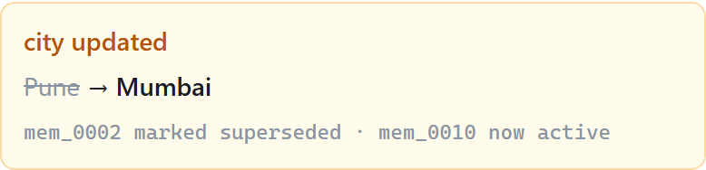
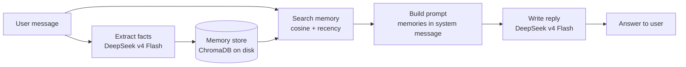

# Chatbot with Long-Term Memory

A chatbot that actually remembers you. Close the program, reopen it a week later, and it still
knows where you live, what you study and what you told it last time.

<p>


</p>

> **Generative AI mini project. Topic 192, Model Making.**
> MIT School of Computing, MIT Art, Design and Technology University.

---

## The problem this solves

A language model has no memory of its own. It answers using only the text inside its context
window, and that window is a fixed size. The moment a conversation ends, everything you said is
gone, so you end up repeating yourself in every new chat.

This project adds the missing piece: a **memory layer** that stores what you said, finds the
relevant parts later, and feeds them back into the conversation.



The panel on the right is the interesting part. It shows every memory the bot used for the current
message, with the actual similarity score, and it flags the moment a new fact replaces an old one.

---

## What it does

| Capability | How it works |
|---|---|
| **Remembers facts** | Each message is read by the language model, which pulls out lasting facts such as `city: Pune` |
| **Searches by meaning** | Text becomes 384 numbers. Questions match memories by meaning, not by shared words |
| **Survives a restart** | Everything is written to disk, so memory outlives the running program |
| **Resolves contradictions** | Say you moved cities and the old fact is retired, never returned again |
| **Controls its own growth** | Raw messages are capped and trimmed. Extracted facts are kept |
| **Protects private data** | Emails, phone numbers and ID numbers are stripped before anything is saved |

### The contradiction bit, in one picture

Tell it you moved from Pune to Mumbai and this appears:



The old record is not deleted. It is marked as replaced and kept as history, while searches only
ever look at current records. That is what stops the bot confidently telling you that you still
live in Pune.

---

## How it works



### Three layers of memory

| Layer | What it holds | Lifetime |
|---|---|---|
| **Working** | The last six messages, word for word | Cleared when the session ends |
| **Episodic** | The raw messages you typed | Stored, searchable, trimmed when large |
| **Semantic** | Short facts such as `city: Mumbai` | Stored, versioned, never trimmed |

Embeddings are computed **on your own machine**, so the memory store never travels to any API.
Only the current message and the few memories retrieved for it are sent out.

---

## Setup guide

Written for Windows, since that is what we develop on. Notes for macOS and Linux are included
where the command differs.

### Before you start

You need three things:

1. **Python 3.11 or newer.** Check with `python --version`. Get it from
   [python.org](https://www.python.org/downloads/) and tick **Add Python to PATH** during install.
2. **Git.** Check with `git --version`.
3. **An AtlasCloud API key**, for the language model. Sign in at
   [atlascloud.ai](https://atlascloud.ai) and create one.

You will also need internet access on the **first run only**, to download the embedding model
(about 90 MB). After that it is cached and the memory features work offline.

### Step 1. Get the code

```bash
git clone https://github.com/Swaraj-Mandre/Long-Term-Memory-Chatbot.git
cd Long-Term-Memory-Chatbot
```

### Step 2. Create a virtual environment

A virtual environment keeps this project's packages separate from everything else on your machine.

```bash
python -m venv .venv
```

Then activate it. **Windows:**

```bash
.venv\Scripts\activate
```

**macOS or Linux:**

```bash
source .venv/bin/activate
```

You will see `(.venv)` at the start of your prompt once it is active. You need to activate it
every time you open a new terminal.

### Step 3. Install the packages

```bash
pip install -r requirements.txt
```

This pulls in ChromaDB, sentence-transformers, PyTorch and the OpenAI client library. It is a few
hundred megabytes and takes a couple of minutes.

<details>
<summary>Faster alternative using <code>uv</code></summary>

If you have [uv](https://github.com/astral-sh/uv) installed, it resolves and installs the same
packages considerably faster:

```bash
uv venv --python 3.11 .venv
uv pip install --python .venv/Scripts/python.exe -r requirements.txt
```

</details>

### Step 4. Add your API key

Copy the example file:

```bash
copy .env.example .env
```

On macOS or Linux use `cp .env.example .env` instead.

Open `.env` in any text editor and put your key after the equals sign:

```
ATLASCLOUD_API_KEY=your_key_goes_here
```

> **Never commit `.env`.** It is already listed in `.gitignore`. Each of us uses our own key.

### Step 5. Check everything works

```bash
python test_connection.py
```

You should see:

```
[1/3] Checking settings...
      OK   model    : deepseek-ai/deepseek-v4-flash
      OK   API key  : found
[2/3] Calling the language model...
      OK   reply    : READY
[3/3] Loading the local embedding model...
      OK   dimensions            : 384
      OK   same meaning score    : 0.821
      OK   unrelated score       : 0.351
  ALL CHECKS PASSED
```

Those last two numbers are the whole idea in miniature. "I live in Pune" and "My home city is
Pune" score **0.821** against each other, while "I enjoy playing cricket" scores **0.351**. The
system compares meaning, not words.

If anything says FAILED, jump to [Troubleshooting](#troubleshooting).

### Step 6. Run it

```bash
python run.py
```

Then open **http://localhost:8000** in your browser. Press `Ctrl+C` in the terminal to stop.

---

## Trying it out

Type these in order to see every feature work:

```
Hi, my name is Swaraj and I live in Pune. I study AI at MIT ADT University.
```

```
My favourite food is misal pav and I have a dog named Bruno.
```

Now click **Start New Session**. This clears the recent-message list, so anything the bot recalls
from here has to come out of the database.

```
Do you remember where I live?
```

It answers Pune. Now contradict it:

```
Actually I moved to Mumbai last week.
```

```
So which city am I in now?
```

Watch the **Contradictions Resolved** panel. The Pune record is marked replaced and Mumbai becomes
the current answer.

Two more things worth trying:

```
My email is you@example.com and my phone is 9876543210
```

Look at the Memory Store panel. Both values were stripped before being written to disk.

```
/forget city
```

That deletes every record about a topic permanently, which is different from replacing it.

---

## Measuring how well it works

```bash
python evaluation/evaluate.py
```

This runs a fixed set of 22 questions whose correct answers were written down before any test was
run, and reports:

| Measure | Result | What it means |
|---|---|---|
| Recall at 4 | **1.000** | Every question found its memory |
| MRR | **1.000** | The correct memory was always ranked first |
| Correct at rank 1 | **22 of 22** | No question was answered from the wrong memory |
| Contradictions handled | **4 of 4** | New value returned, old value never |
| Precision at 4 | 0.694 | Capped at 0.25 by design, see note below |

Each question has exactly one correct memory and we return four, so precision cannot exceed 0.25
before anything else is considered. Rank one accuracy and MRR are the measures that fit this task.

Accuracy is deliberately **not** reported. Almost every stored memory is irrelevant to any single
question, so a system that returned nothing at all would still score well on accuracy while being
useless.

The script also sweeps the similarity threshold and shows what each value costs, which is how the
current setting of `0.25` in `config.py` was chosen.

---

## Project structure

```
.
├── config.py                     every setting in one place
├── llm_client.py                 talks to DeepSeek v4 Flash via AtlasCloud
├── embedder.py                   turns text into vectors, runs locally
├── vector_store.py               ChromaDB behind a swappable interface
├── memory_manager.py             the brain: 3 layers, replacement, trimming, privacy
├── chat_engine.py                one full turn of conversation
├── run.py                        start the web interface
├── test_connection.py            startup checks
│
├── web/
│   ├── server.py                 HTTP server, standard library only
│   └── static/                   index.html, style.css, app.js
│
├── evaluation/
│   ├── probe_set.py              the test questions and expected answers
│   └── evaluate.py               precision, recall, MRR, contradiction tests
│
├── docs/
│   ├── capture_screenshots.py    regenerates every figure from the live app
│   └── assets/                   those figures
│
└── presentation/
    ├── build_deck.js             generates the slide deck
    └── Chatbot_Long_Term_Memory_Jury1.pptx
```

Each file has one job, and the reasoning behind the tricky parts is written in the comments rather
than left for you to guess.

---

## Troubleshooting

<details>
<summary><b>ATLASCLOUD_API_KEY is not set</b></summary>

You have not created `.env` yet, or the key line is empty. Copy `.env.example` to `.env` and put
your key after `ATLASCLOUD_API_KEY=` with no quotes and no spaces.

</details>

<details>
<summary><b>The API rejected the key (401)</b></summary>

Check the key is complete and has not expired. A key that can list models but not run them usually
means the account has no credit.

</details>

<details>
<summary><b>The model ran out of tokens while thinking</b></summary>

DeepSeek v4 Flash reasons internally before answering, and that reasoning counts against
`max_tokens`. If the budget runs out first, the answer comes back empty. Raise
`CHAT_MAX_TOKENS` or `EXTRACT_MAX_TOKENS` in `config.py`.

</details>

<details>
<summary><b>It hangs on "Loading the local embedding model"</b></summary>

The first run downloads about 90 MB. You need internet for that one time only. After it is cached,
this step takes under a second.

</details>

<details>
<summary><b>Port 8000 is already in use</b></summary>

Another copy of the server is still running. Close it, or change `PORT` in your `.env`.

</details>

<details>
<summary><b>ModuleNotFoundError</b></summary>

Your virtual environment is probably not active. Look for `(.venv)` at the start of your prompt
and run the activate command from Step 2 again.

</details>

<details>
<summary><b>Starting completely fresh</b></summary>

Delete the `memory_data` folder, or click **Wipe Memory** in the interface.

</details>

---

## Team

| Name | Section |
|---|---|
| Swaraj Mandre | Memory design and retrieval |
| Saumya Joshi | Language model integration |
| Siddhant Pawar | Evaluation and interface |

Guided by **Prof. Dr. Snehalata Funde**.

---

## Notes and sources

The memory design follows ideas from published work rather than being invented from scratch:

- Vaswani et al., *Attention Is All You Need*, NeurIPS 2017
- Packer et al., *MemGPT: Towards LLMs as Operating Systems*, arXiv:2310.08560, 2023
- Reimers and Gurevych, *Sentence-BERT*, EMNLP 2019
- OpenAI, *Memory and new controls for ChatGPT*, February 2024
- [Mem0](https://github.com/mem0ai/mem0), an open source memory layer

This is coursework, shared for reference and for our own team to work from.
